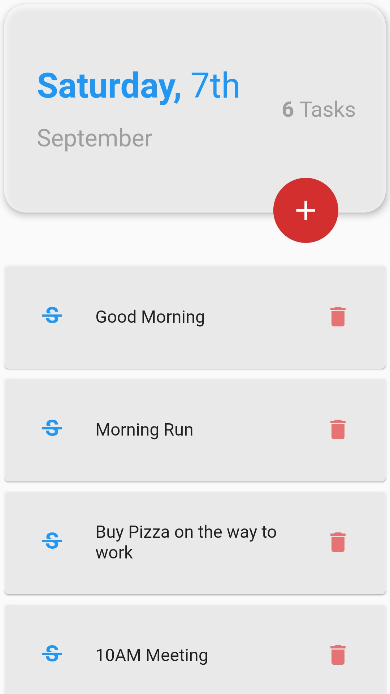
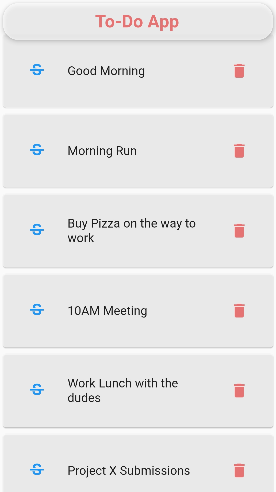
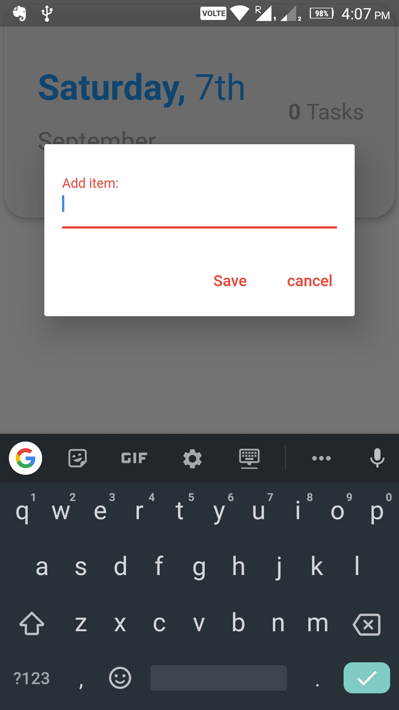
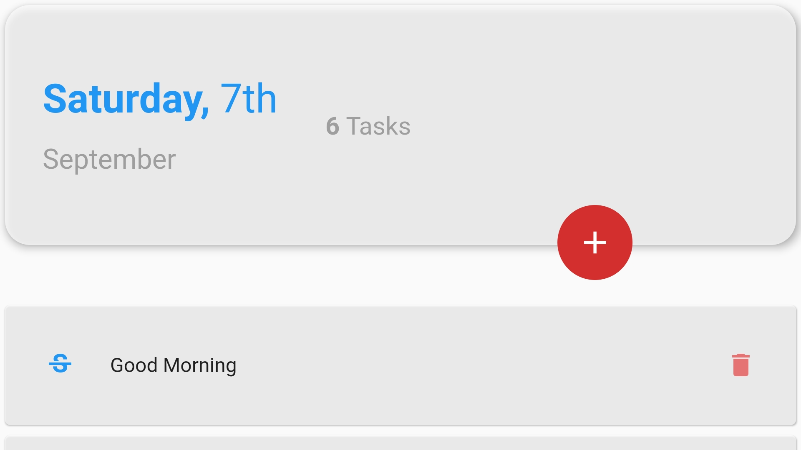
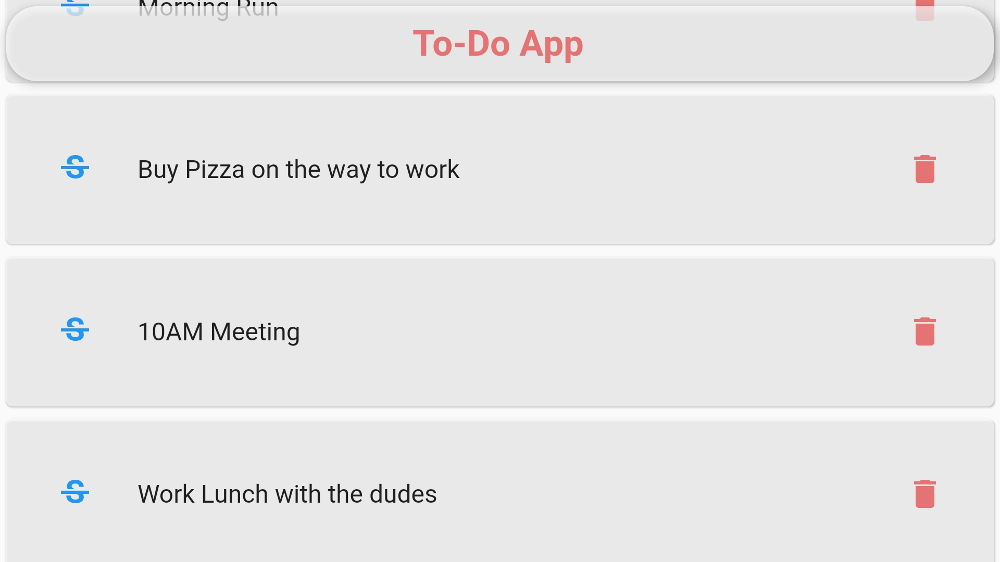

# To - Do App

A To - Do App with minimum features, just enought to be useful which is created In Flutter.

# Screenshots
<table>
  <tr><td></td>
  </td></td>
  </td></td></tr>
<tr><td></td></tr>
<tr><td></td></tr>
</table>

# Overview
To - Do Mobile Application is for all the users who want to save their future work that they may forget.
It's Simplicity and User Interface makes a person happy.

# Technology Stack
<ul>
<li>Flutter</li>
<li>Sqlite</li>
<li>Flutter Provider</li>
</ul>

# Contributing
Awesome! Contributions of all kinds are greatly appreciated. To help smoothen the process we have a few non-exhaustive guidelines to follow which should get you going in no time.

# Using GitHub Issues
<ul>
<li>Feel free to use GitHub issues for questions, bug reports, and feature requests</li>
<li>Use the search feature to check for an existing issue</li>
<li>Include as much information as possible and provide any relevant resources (Eg. screenshots)</li>
<li>For bug reports ensure you have a reproducible test case
<li>A pull request with a breaking test would be super preferable here but isn't required</li></li>
</ul>

# Submitting a Pull Request
<ul>
<li>Squash commits</li>
<li>Include relevant test updates/additions</li>
</ul>
